# Sistema de Gestión de Productos Financieros

## Descripción

Sistema para la gestión de productos financieros desarrollado en Java siguiendo los principios de la Programación Orientada a Objetos. Permite gestionar diferentes tipos de cuentas bancarias: cuentas de ahorro, cuentas corrientes, cuentas de ahorro programado para vivienda y cuentas especiales para pago de salario.

## Características

- Gestión de múltiples tipos de productos financieros
- Operaciones de depósito y retiro con validaciones específicas por tipo de cuenta
- Consultas por número de producto o por titular
- Listado completo de titulares y productos
- Validación de datos de entrada con manejo de errores (try-catch-finally)
- Menú interactivo para gestión completa del sistema
- **Arquitectura profesional** siguiendo principios de Domain-Driven Design (DDD)
- **Patrón Repository** para separación de la lógica de acceso a datos
- **Excepciones personalizadas** con manejo inteligente de mensajes
- **Restricción de un producto por cliente** para simplificar el modelo de negocio
- **Separación de responsabilidades** en capas bien definidas
- **Interface Segregation Principle (ISP)** - Interfaces `Depositable` y `Withdrawable` segregadas
- **Flexibilidad de operaciones** - Cuentas implementan solo las interfaces que necesitan

## Tipos de Productos Financieros

### 1. Cuenta de Ahorro

- **Características**: Valor acumulado por intereses, fecha del último depósito y valor del último depósito
- **Operaciones**:
  - **Depósito**: Calcula un interés del 3% sobre el saldo y lo suma al valor acumulado por intereses
  - **Retiro**: Valida que el monto no supere al saldo

### 2. Cuenta Corriente

- **Características**: Valor de sobregiro, fecha de la última operación, valor de la última operación y tipo de operación
- **Operaciones**:
  - **Depósito**: Operación estándar
  - **Retiro**: Permite sobregiro cuando el monto supera al saldo actual, validando que no exceda saldo + sobregiro

### 3. Cuenta de Ahorro Programado para Vivienda

- **Características**: Valor total de la vivienda, clasificación comercial (VIS, VIP, VIS Renovación, No VIS), fecha del último pago y valor del último pago
- **Operaciones**:
  - **Depósito**: Valida si el valor total pagado supera el valor total de la vivienda
  - **Retiro**: ❌ **NO PERMITIDO** - Esta cuenta solo acepta depósitos (implementa únicamente Depositable)

### 4. Cuenta Especial para Pago de Salario

- **Características**: Valor pagado como salario, fecha del último retiro y valor del último retiro
- **Operaciones**:
  - **Depósito**: Operación estándar de depósito
  - **Retiro**: Valida que no supere el valor pagado como salario

## Diagrama de Clases

```mermaid
classDiagram
    %% Paquetes y notas
    note for FinancialProduct "Producto Financiero (concreto)"
    note for SavingsAccount "Cuenta de Ahorro"
    note for CheckingAccount "Cuenta Corriente"
    note for HousingSavingsAccount "Cuenta Ahorro Vivienda (solo depósitos)"
    note for SalaryAccount "Cuenta Especial Salario"
    note for Customer "Cliente/Titular"
    note for FinancialCompany "Servicio de Negocio"
    note for ProductRepository "Repositorio de Datos"
    note for Depositable "Interfaz de Depósitos"
    note for Withdrawable "Interfaz de Retiros"

    %% Interfaces Segregadas (ISP)
    class Depositable {
        <<interface>>
        +deposit(amount : double) : String
    }

    class Withdrawable {
        <<interface>>
        +withdraw(amount : double) : String
    }

    class ProductRepository {
        <<interface>>
        +addProduct(product : FinancialProduct) : void
        +findByProductNumber(productNumber : String) : FinancialProduct
        +findByCustomerIdentification(customerIdentification : String) : FinancialProduct
        +existsByCustomerIdentification(customerIdentification : String) : boolean
        +getAllProducts() : List~FinancialProduct~
        +existsByProductNumber(productNumber : String) : boolean
    }

    %% Entidades del Dominio
    class FinancialProduct {
        -productNumber : String
        -openingDate : LocalDate
        -customer : Customer
        -balance : double
        +FinancialProduct(productNumber : String, openingDate : LocalDate, customer : Customer, balance : double)
        +getProductNumber() : String
        +getOpeningDate() : LocalDate
        +getCustomer() : Customer
        +getBalance() : double
        #setBalance(balance : double) : void
        +getProductType() : String
        +toString() : String
    }

    class Customer {
        -identification : String
        -firstName : String
        -lastName : String
        -phone : String
        +Customer(identification : String, firstName : String, lastName : String, phone : String)
        +getIdentification() : String
        +getFirstName() : String
        +getLastName() : String
        +getPhone() : String
        +getFullName() : String
        +toString() : String
    }

    %% Implementaciones de Cuentas
    class SavingsAccount {
        -accumulatedInterest : double
        -lastDepositDate : LocalDate
        -lastDepositAmount : double
        +SavingsAccount(productNumber : String, openingDate : LocalDate, customer : Customer, balance : double)
        +getAccumulatedInterest() : double
        +getLastDepositDate() : LocalDate
        +getLastDepositAmount() : double
        +getProductType() : String
        +deposit(amount : double) : String
        +withdraw(amount : double) : String
        +toString() : String
    }

    class CheckingAccount {
        -overdraftLimit : double
        -lastOperationDate : LocalDate
        -lastOperationAmount : double
        -lastOperationType : OperationType
        +CheckingAccount(productNumber : String, openingDate : LocalDate, customer : Customer, balance : double, overdraftLimit : double)
        +getOverdraftLimit() : double
        +getLastOperationDate() : LocalDate
        +getLastOperationAmount() : double
        +getLastOperationType() : OperationType
        +getProductType() : String
        +deposit(amount : double) : String
        +withdraw(amount : double) : String
        -updateLastOperation(amount : double, operationType : OperationType) : void
        +toString() : String
    }

    class HousingSavingsAccount {
        -totalHousingValue : double
        -classification : HousingClassification
        -lastPaymentDate : LocalDate
        -lastPaymentAmount : double
        -totalPaid : double
        +HousingSavingsAccount(productNumber : String, openingDate : LocalDate, customer : Customer, balance : double, totalHousingValue : double, classification : HousingClassification)
        +getTotalHousingValue() : double
        +getClassification() : HousingClassification
        +getLastPaymentDate() : LocalDate
        +getLastPaymentAmount() : double
        +getTotalPaid() : double
        +getProductType() : String
        +deposit(amount : double) : String
        +toString() : String
    }

    class SalaryAccount {
        -salaryAmount : double
        -lastWithdrawalDate : LocalDate
        -lastWithdrawalAmount : double
        +SalaryAccount(productNumber : String, openingDate : LocalDate, customer : Customer, balance : double, salaryAmount : double)
        +getSalaryAmount() : double
        +setSalaryAmount(salaryAmount : double) : void
        +getLastWithdrawalDate() : LocalDate
        +getLastWithdrawalAmount() : double
        +getProductType() : String
        +deposit(amount : double) : String
        +withdraw(amount : double) : String
        +toString() : String
    }

    %% Servicios y Repositorios
    class FinancialCompany {
        -repository : ProductRepository
        +FinancialCompany(repository : ProductRepository)
        +createSavingsAccount(productNumber : String, customer : Customer, initialBalance : double) : SavingsAccount
        +createCheckingAccount(productNumber : String, customer : Customer, initialBalance : double, overdraftLimit : double) : CheckingAccount
        +createHousingSavingsAccount(productNumber : String, customer : Customer, initialBalance : double, totalHousingValue : double, classification : HousingClassification) : HousingSavingsAccount
        +createSalaryAccount(productNumber : String, customer : Customer, initialBalance : double, salaryAmount : double) : SalaryAccount
        +performDeposit(productNumber : String, amount : double) : String
        +performWithdrawal(productNumber : String, amount : double) : String
        +consultByProductNumber(productNumber : String) : FinancialProduct
        +consultByCustomer(customerIdentification : String) : FinancialProduct
        +getAllProducts() : List~FinancialProduct~
        -findProduct(productNumber : String) : FinancialProduct
    }

    class FinancialCompanyRepository {
        -products : List~FinancialProduct~
        +addProduct(product : FinancialProduct) : void
        +findByProductNumber(productNumber : String) : FinancialProduct
        +findByCustomerIdentification(customerIdentification : String) : FinancialProduct
        +existsByCustomerIdentification(customerIdentification : String) : boolean
        +getAllProducts() : List~FinancialProduct~
        +existsByProductNumber(productNumber : String) : boolean
    }

    %% Aplicación
    class FinancialCompanyManagementApp {
        -financialCompany : FinancialCompany
        -validator : InputValidator
        +main(args : String[]) : void
        +showMenu() : void
        -demonstrateOperations() : void
        -createAccountMenu() : void
        -performOperationMenu() : void
        -consultByProductNumberMenu() : void
        -consultByCustomerMenu() : void
        -listAllCustomersMenu() : void
        -createCustomerMenu() : Customer
        -getHousingClassificationMenu() : HousingClassification
        -log(message : String) : void
    }

    %% Utilidades
    class InputValidator {
        -scanner : Scanner
        +InputValidator(scanner : Scanner)
        +getValidString(prompt : String) : String
        +getValidInteger(prompt : String) : int
        +getValidPositiveInteger(prompt : String) : int
        +getValidAmount(prompt : String) : double
        +getValidUniqueProductNumber(prompt : String, repository : ProductRepository) : String
    }

    %% Enumeraciones
    class HousingClassification {
        <<enumeration>>
        VIS
        VIP
        VIS_RENOVACION
        NO_VIS
    }

    class OperationType {
        <<enumeration>>
        DEPOSIT
        WITHDRAWAL
    }

    %% Excepciones
    class InsufficientFundsException {
        <<exception>>
        +InsufficientFundsException()
        +InsufficientFundsException(currentBalance : double, overdraftLimit : double, attemptedAmount : double)
        +InsufficientFundsException(customMessage : String)
        +InsufficientFundsException(cause : Throwable)
    }

    class ProductNotFoundException {
        <<exception>>
        +ProductNotFoundException(message : String)
    }

    %% Relaciones de Herencia
    FinancialProduct <|-- SavingsAccount : extends
    FinancialProduct <|-- CheckingAccount : extends
    FinancialProduct <|-- HousingSavingsAccount : extends
    FinancialProduct <|-- SalaryAccount : extends
    ProductRepository <|.. FinancialCompanyRepository : implements
    
    %% Implementación de Interfaces Segregadas (ISP)
    Depositable <|.. SavingsAccount : implements
    Withdrawable <|.. SavingsAccount : implements
    Depositable <|.. CheckingAccount : implements
    Withdrawable <|.. CheckingAccount : implements
    Depositable <|.. HousingSavingsAccount : implements
    Depositable <|.. SalaryAccount : implements
    Withdrawable <|.. SalaryAccount : implements

    %% Relaciones de Composición/Agregación
    FinancialProduct --> Customer : has
    FinancialCompany --> ProductRepository : uses
    FinancialCompanyManagementApp --> FinancialCompany : uses
    FinancialCompanyManagementApp --> InputValidator : uses
    HousingSavingsAccount --> HousingClassification : uses
    CheckingAccount --> OperationType : uses

    %% Relaciones de Dependencia
    FinancialProduct ..> InsufficientFundsException : throws
    FinancialCompany ..> ProductNotFoundException : throws
    FinancialCompany ..> InsufficientFundsException : throws
```



## Estructura del Proyecto

```
java_oop/
├── src/main/java/com/example/financial_products_management/
│   ├── application/                           # Capa de Aplicación
│   │   └── FinancialCompanyManagementApp.java    # Aplicación principal
│   ├── domain/                               # Capa de Dominio (Lógica de Negocio)
│   │   ├── customer/                         # Agregado Cliente
│   │   │   └── Customer.java                 # Entidad Cliente
│   │   ├── financial_company/                # Servicio de Negocio
│   │   │   └── FinancialCompany.java         # Servicio Financiero
│   │   ├── financial_product/                # Agregado Producto Financiero
│   │   │   └── model/
│   │   │       ├── FinancialProduct.java     # Clase concreta base
│   │   │       └── account/                  # Implementaciones de cuentas
│   │   │           ├── CheckingAccount.java      # Cuenta Corriente
│   │   │           ├── HousingSavingsAccount.java # Cuenta Ahorro Vivienda
│   │   │           ├── SalaryAccount.java        # Cuenta Salario
│   │   │           └── SavingsAccount.java       # Cuenta de Ahorro
│   │   ├── repository/                       # Interfaces y Repositorios
│   │   │   ├── ProductRepository.java        # Interfaz de Repositorio
│   │   │   └── FinancialCompanyRepository.java # Implementación
│   │   └── shared/                           # Conceptos Compartidos del Dominio
│   │       ├── Depositable.java              # Interfaz de Depósitos (ISP)
│   │       ├── Withdrawable.java             # Interfaz de Retiros (ISP)
│   │       ├── HousingClassification.java    # Enum Clasificación Vivienda
│   │       └── OperationType.java            # Enum Tipos de Operación
│   ├── exception/                            # Excepciones Personalizadas
│   │   ├── InsufficientFundsException.java   # Excepción Fondos Insuficientes
│   │   └── ProductNotFoundException.java     # Excepción Producto No Encontrado
│   ├── infrastructure/                       # Capa de Infraestructura
│   │   └── validation/                       # Utilidades Técnicas
│   │       └── InputValidator.java           # Validador de Entrada
│   └── README.md                            # Documentación del Proyecto
└── README.md                                # Documentación General
```

## Compilación y Ejecución

### Requisitos

- Java 8 o superior

### Compilación

```bash
# Navegar al directorio del proyecto
cd /ruta/a/java_oop

# Compilar el proyecto
javac -d out $(find src/main/java -name "*.java")
```

### Ejecución

```bash
# Desde el directorio del proyecto
java -cp out com.example.financial_products_management.application.FinancialCompanyManagementApp
```

## Funcionalidades del Sistema

### 1. Crear Cuentas

- Permite crear cualquiera de los 4 tipos de productos financieros
- Validación de datos de entrada con try-catch
- Asignación de números únicos de producto
- Captura completa de datos del titular

### 2. Realizar Operaciones

- Búsqueda de productos por número
- Operaciones de depósito y retiro según las reglas de cada tipo de cuenta
- Validaciones específicas por tipo de producto
- Mensajes informativos de resultado

### 3. Consultar Productos

- **Por número de producto**: Muestra datos completos del titular y producto
- **Por titular**: Busca todos los productos asociados a una identificación

### 4. Listado de Titulares

- Formato tabular con todos los datos relevantes:
  - Datos del titular
  - Número de producto
  - Fecha de apertura
  - Tipo de producto
  - Saldo actual

## Validaciones Implementadas

### Validación de Datos de Entrada

- **Números de cuenta**: Deben ser enteros positivos y únicos
- **Datos del cliente**: Validación de campos obligatorios no vacíos
- **Opciones del menú**: Validación de opciones válidas
- **Montos**: Deben ser números positivos

### Validaciones de Negocio

- **Cuenta de Ahorro**: Saldo insuficiente para retiros
- **Cuenta Corriente**: Validación de sobregiro con mensajes detallados
- **Cuenta Ahorro Vivienda**: Control de valor total pagado vs. valor de vivienda
- **Cuenta Salario**: Validación de retiros vs. valor del salario (ahora usa `IllegalArgumentException` por ser regla de negocio)
- **Restricción de cliente único**: Cada cliente puede tener solo un producto financiero

## Manejo de Errores

El sistema implementa bloques try-catch-finally para:

- Validación de entrada de datos numéricos
- Manejo de excepciones en operaciones bancarias
- Gestión de errores en consultas y búsquedas
- Validación de opciones de menú

## Mensajes del Sistema

### Mensajes de Validación

- `"SALDO INSUFICIENTE"` - Para retiros que exceden el saldo disponible
- `"VALOR TOTAL PAGADO SUPERA EL VALOR DE LA VIVIENDA"` - Para cuentas de ahorro vivienda
- Mensajes específicos para validación de montos y datos

### Mensajes Informativos

- Confirmaciones de operaciones exitosas
- Información detallada de saldos y estados
- Reportes de intereses generados y operaciones realizadas

## Ejemplo de Uso

El sistema inicia con datos de ejemplo y luego presenta un menú interactivo:

```
=== FINANCIERA MUCHA PLATA ===
1. Crear nueva cuenta
2. Realizar operación (depósito/retiro)
3. Consultar producto por número
4. Consultar producto por titular
5. Lista de todos los titulares
0. Salir
```

## Patrones y Principios de Diseño Implementados

### **Patrones de Diseño**
- **Repository Pattern**: Separación de la lógica de acceso a datos
- **Domain-Driven Design (DDD)**: Organización por dominios de negocio
- **Interface Segregation Principle (ISP)**: Interfaces específicas y cohesivas
- **Dependency Injection**: Inyección de dependencias en servicios

### **Principios SOLID**
- **Single Responsibility**: Cada clase tiene una responsabilidad específica
- **Open/Closed**: Extensible para nuevos tipos de cuenta sin modificar código existente
- **Liskov Substitution**: Las subclases pueden sustituir a la clase base
- **Interface Segregation**: Interfaces pequeñas y específicas
- **Dependency Inversion**: Dependencias hacia abstracciones, no implementaciones

### **Mejoras en el Manejo de Excepciones**
- **`InsufficientFundsException`**: Manejo inteligente de mensajes según el contexto
  - Mensaje por defecto para casos simples
  - Mensaje detallado para cuentas corrientes con información de sobregiro
  - Constructores específicos para diferentes escenarios
- **`ProductNotFoundException`**: Excepción específica para productos no encontrados
- **Separación semántica**: Violaciones de reglas de negocio (`IllegalArgumentException`) vs. problemas de fondos (`InsufficientFundsException`)

### **Restricciones de Negocio**
- **Un producto por cliente**: Simplifica el modelo y evita complejidad innecesaria
- **Validaciones específicas por tipo de cuenta**: Cada cuenta implementa sus propias reglas
- **Operaciones atómicas**: Cada operación es independiente y consistente

## Notas Adicionales

- El sistema utiliza `LocalDate` para manejo de fechas
- Implementa herencia y polimorfismo para los diferentes tipos de cuentas
- Utiliza enumeraciones para clasificaciones y tipos de operaciones
- Manejo robusto de errores con try-catch en todas las operaciones críticas
- Interfaz de usuario intuitiva con validaciones completas
- **Arquitectura escalable** preparada para futuras extensiones
- **Código limpio** siguiendo las mejores prácticas de la industria
