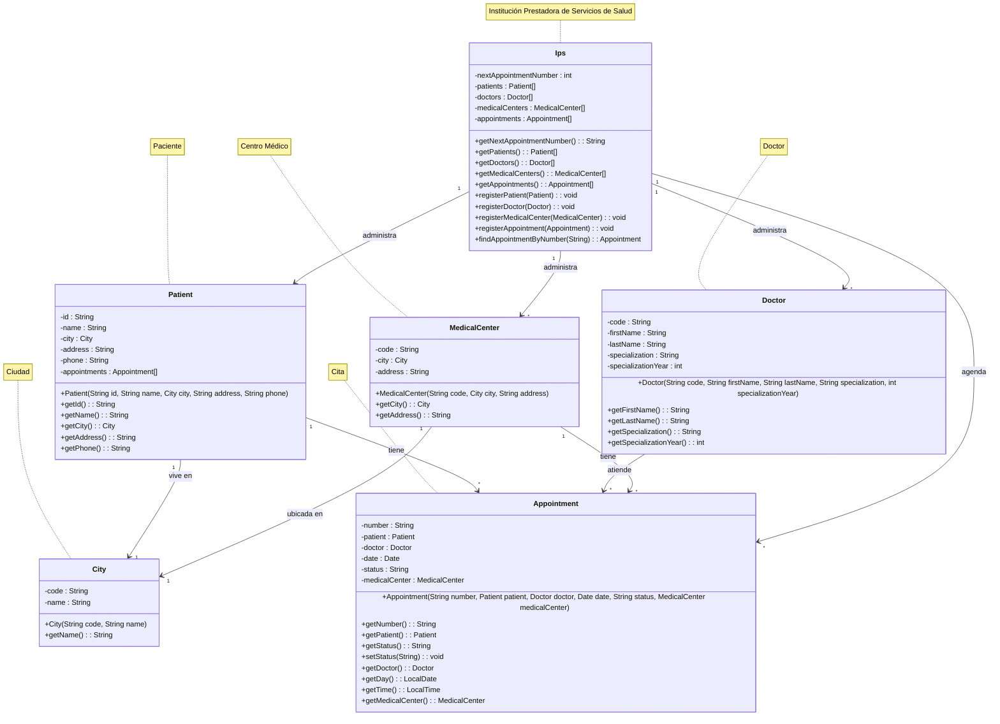

# Sistema de Gestión de Citas Médicas (IPS)

## Descripción

Sistema para la gestión de citas médicas que permite a los pacientes agendar citas con especialistas en diferentes
centros médicos, desarrollado en Java siguiendo los principios de la Programación Orientada a Objetos.

## Características

- Gestión de pacientes, doctores y centros médicos
- Agendamiento de citas
- Búsqueda de cita por número
- Generación automática de números de citas

## Diagrama de Clases



## Estructura del Proyecto

```
java_oop/
├── src/
│   └── com/
│       └── example/
│           └── ips_management/
│               ├── model/       # Clases del modelo de dominio
│               │   ├── Appointment.java
│               │   ├── City.java
│               │   ├── Doctor.java
│               │   ├── Ips.java
│               │   ├── MedicalCenter.java
│               │   └── Patient.java
│               └── main/        # Clase principal de la aplicación
│                   └── IpsManagementApp.java
└── README.md
```

## Compilación y Ejecución

### Requisitos

- Java 8 o superior

### Compilación

```bash
# Navegar al directorio del proyecto
cd /ruta/a/java_oop

# Compilar el proyecto
javac -d out $(find src/main/java -name "*.java")
```

### Ejecución

```bash
# Desde el directorio del proyecto
java -cp out com.example.ips_management.main.IpsManagementApp
```

## Uso

El sistema demuestra las siguientes funcionalidades:

1. Creación de ciudades, centros médicos, doctores y pacientes
2. Registro de citas médicas
3. Búsqueda de citas por número
4. Visualización de información detallada de las citas

El sistema incluye una demostración con datos de ejemplo que muestra el flujo completo de:

- Creación de pacientes, doctores y centros médicos
- Agendamiento de citas
- Búsqueda y visualización de citas existentes

## Diagrama de Clases

## Notas Adicionales

- El sistema genera automáticamente números de cita secuenciales.
- Las citas pueden tener diferentes estados: "programada", "completada", "cancelada".
- Se incluye un conjunto de datos de ejemplo para pruebas con doctores, pacientes y centros médicos.
