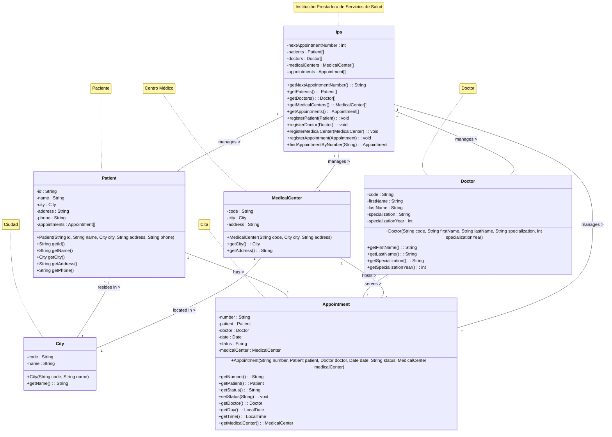

# Modelo de Dominio - Sistema de Citas Médicas

## Descripción

Este documento describe las clases del modelo de dominio del Sistema de Gestión de Citas Médicas, que representan las
entidades principales y sus relaciones.

## Diagrama de Clases

