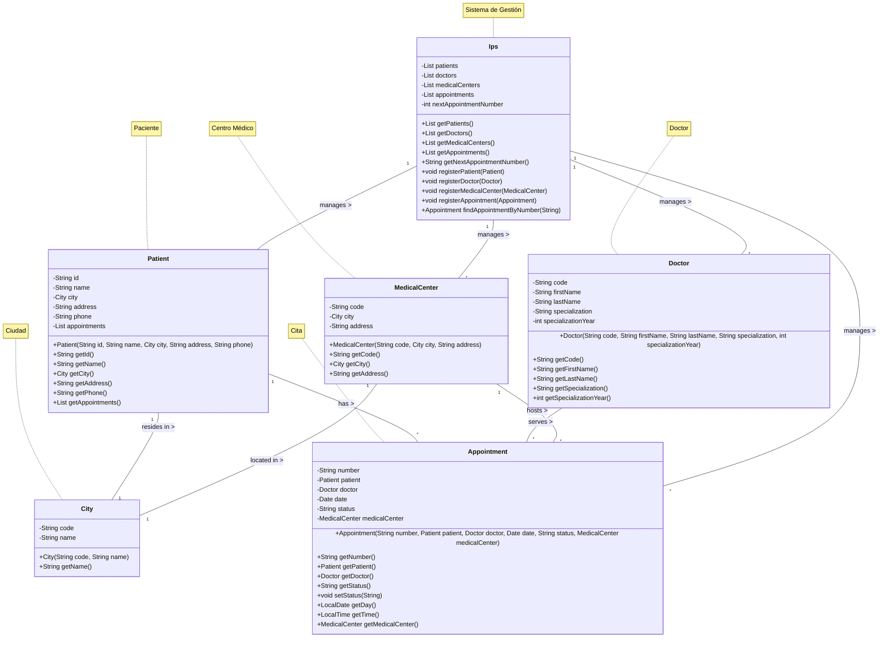

# Modelo de Dominio - Sistema de Citas Médicas

## Descripción

Este documento describe las clases del modelo de dominio del Sistema de Gestión de Citas Médicas, que representan las
entidades principales y sus relaciones.

## Entidades Principales

### 1. City (Ciudad)

Representa una ciudad donde se ubican los centros médicos.

- **Atributos:**
  - `code`: Código único de la ciudad (ej: "BOG")
  - `name`: Nombre de la ciudad (ej: "Bogotá")

### 2. MedicalCenter (Centro Médico)

Representa un establecimiento de salud donde se atienden las citas.

- **Atributos:**
  - `code`: Código único del centro médico
  - `city`: Ciudad donde se ubica el centro
  - `address`: Dirección física del centro

### 3. Doctor (Médico)

Representa a un profesional de la salud que atiende citas.

- **Atributos:**
  - `code`: Código único del médico
  - `firstName`: Nombre del médico
  - `lastName`: Apellido del médico
  - `specialization`: Especialidad médica
  - `specializationYear`: Año de especialización

### 4. Patient (Paciente)

Representa un paciente que solicita citas médicas.

- **Atributos:**
  - `id`: Identificación única
  - `name`: Nombre completo del paciente
  - `city`: Ciudad de residencia
  - `address`: Dirección del paciente
  - `phone`: Número de teléfono
  - `appointments`: Lista de citas del paciente

### 5. Appointment (Cita Médica)

Representa una cita médica programada.

- **Atributos:**
  - `number`: Número único de cita
  - `patient`: Paciente de la cita
  - `doctor`: Médico asignado
  - `date`: Fecha y hora de la cita
  - `status`: Estado actual (programada/completada/cancelada)
  - `medicalCenter`: Centro médico donde se realizará

### 6. Ips (Institución Prestadora de Servicios de Salud)

Clase principal que actúa como el núcleo del sistema de gestión de citas médicas, coordinando todas las operaciones
entre las diferentes entidades.

- **Atributos:**
  - `patients`: Lista de todos los pacientes registrados en el sistema
  - `doctors`: Lista de todos los médicos disponibles
  - `medicalCenters`: Lista de centros médicos afiliados
  - `appointments`: Registro histórico de todas las citas agendadas
  - `appointmentCounter`: Contador secuencial para generar números de cita únicos

## Relaciones

- Un `MedicalCenter` pertenece a una `City` (1:1)
- Un `Patient` tiene una `City` de residencia (1:1)
- Un `Patient` puede tener múltiples `Appointment` (1:N)
- Un `Doctor` puede tener múltiples `Appointment` (1:N)
- Un `MedicalCenter` puede tener múltiples `Appointment` (1:N)
- Cada `Appointment` está asociada a un `Patient`, un `Doctor` y un `MedicalCenter` (N:1)

## Diagrama de Clases

