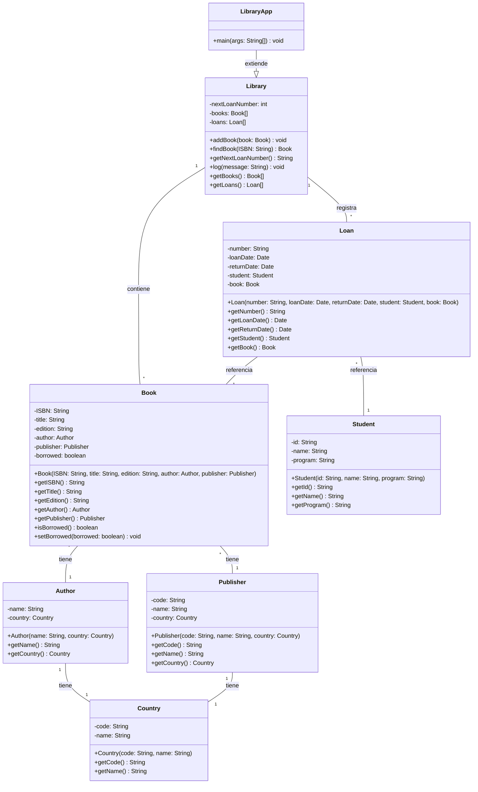

# Sistema de Biblioteca Universitaria

## Descripción

Sistema de gestión de préstamos de libros para una biblioteca universitaria desarrollado en Java siguiendo los
principios de la Programación Orientada a Objetos.

## Características

- Gestión de libros, autores, editoriales y estudiantes
- Sistema de préstamos con seguimiento de fechas
- Búsqueda de libros por ISBN
- Generación automática de números de préstamo

## Estructura del Proyecto

```
university-library/
├── src/
│   └── main/
│       └── java/
│           └── co/
│               └── edu/
│                   └── umng/
│                       └── poo/
│                           └── university_library/
│                               ├── model/    # Clases del modelo de dominio
│                               └── main/     # Clase principal de la aplicación
└── README.md
```

## Diagrama de Clases



## Compilación y Ejecución

### Requisitos

- Java 8 o superior
- Maven (opcional, pero recomendado)

### Compilación

```bash
# Navegar al directorio del proyecto
cd /ruta/a/university-library

# Compilar el proyecto
javac -d target/classes -sourcepath src/main/java src/main/java/co/edu/umng/poo/university_library/main/Main.java
```

### Ejecución

```bash
# Desde el directorio del proyecto
java -cp target/classes main.university_library.java_oop.UniversityLibraryApp
```

## Notas

- El sistema genera automáticamente números de préstamo secuenciales.
- Los libros marcados como prestados no pueden ser prestados nuevamente hasta ser devueltos.
- Se incluye un conjunto de datos de ejemplo para pruebas.
