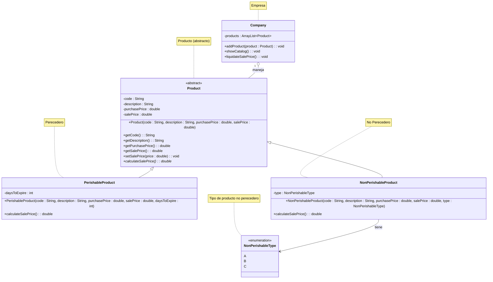

# Catálogo de Ventas de Productos Alimenticios

## Descripción

Sistema para la gestión de ventas de productos alimenticios, desarrollado en Java siguiendo los principios de la
Programación Orientada a Objetos. Permite registrar productos perecederos y no perecederos, mostrar el catálogo y
calcular el precio de venta según reglas específicas.

## Características

- Gestión de productos alimenticios (perecederos y no perecederos)
- Cálculo automático del precio de venta según tipo de producto o días de caducidad
- Catálogo dinámico de productos
- Validación automática del tipo de producto no perecedero (A, B o C)

## Diagrama de Clases



## Estructura del Proyecto

```
java_oop/
├── src/
│   └── com/
│       └── example/
│           └── sales_food_catalog/
│               ├── model/       # Clases del modelo de dominio
│               │   ├── Product.java
│               │   ├── PerishableProduct.java
│               │   └── NonPerishableProduct.java
│               └── main/        # Clase principal de la aplicación
│                   └── SalesFoodCatalogApp.java
└── README.md
```

## Compilación y Ejecución

### Requisitos

- Java 8 o superior

### Compilación

```bash
# Navegar al directorio del proyecto
cd /ruta/a/java_oop

# Compilar el proyecto
javac -d out $(find src/main/java -name "*.java")
```

### Ejecución

```bash
# Desde el directorio del proyecto
java -cp out com.example.sales_food_catalog.main.SalesFoodCatalogApp
```

## Uso

El sistema demuestra las siguientes funcionalidades:

1. Creación de productos perecederos y no perecederos
2. Adición de productos al catálogo dinámico
3. Visualización del catálogo de productos
4. Cálculo y actualización del precio de venta según las reglas de negocio

## Notas Adicionales

- Los productos perecederos reducen su precio en función de los días restantes hasta la caducidad.
- Los productos no perecederos aumentan su precio según la categoría de calidad (A, B o C).
- Si se ingresa un tipo no válido para productos no perecederos, se asigna automáticamente el tipo B.
