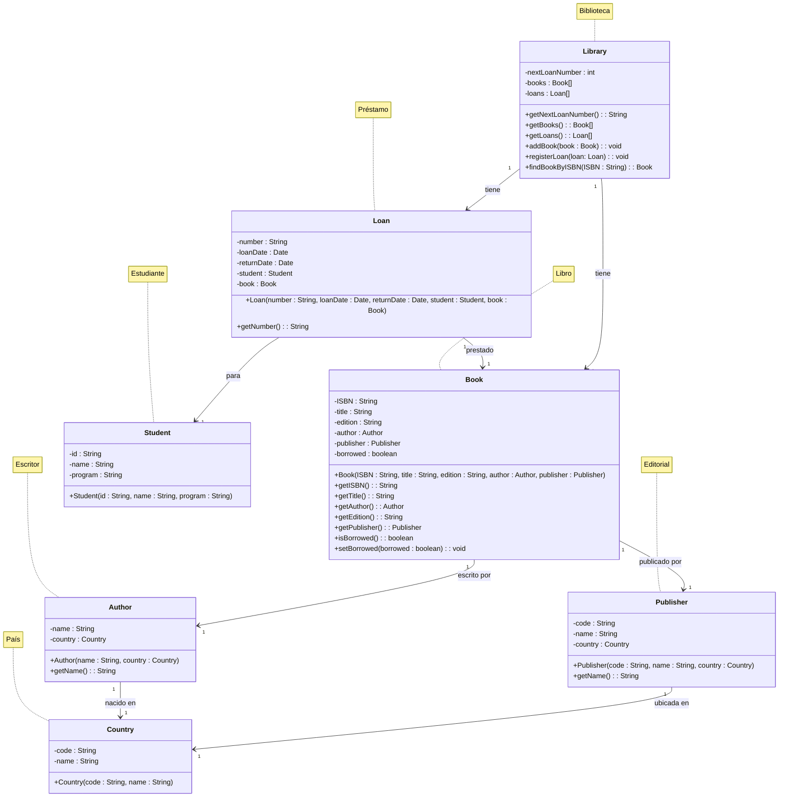

# Sistema de Biblioteca Universitaria

## Descripción

Sistema de gestión de préstamos de libros para una biblioteca universitaria desarrollado en Java siguiendo los
principios de la Programación Orientada a Objetos.

## Características

- Gestión de libros, autores, editoriales y estudiantes
- Sistema de préstamos con seguimiento de fechas
- Búsqueda de libros por ISBN
- Generación automática de números de préstamo

## Diagrama de Clases



## Estructura del Proyecto

```
java_oop/
├── src/
│   └── com/
│       └── example/
│           └── university_library/
│               ├── model/       # Clases del modelo de dominio
│               │   ├── Country.java
│               │   ├── Author.java
│               │   ├── Publisher.java
│               │   ├── Book.java
│               │   ├── Student.java
│               │   ├── Loan.java
│               │   └── Library.java
│               └── main/        # Clase principal de la aplicación
│                   └── UniversityLibraryApp.java
└── README.md
```

## Compilación y Ejecución

### Requisitos

- Java 8 o superior

### Compilación

```bash
# Navegar al directorio del proyecto
cd /ruta/a/university-library

# Compilar el proyecto
javac -d out $(find src/main/java -name "*.java")
```

### Ejecución

```bash
# Desde el directorio del proyecto
java -cp out com.example.university_library.main.UniversityLibraryApp
```

## Notas

- El sistema genera automáticamente números de préstamo secuenciales.
- Los libros marcados como prestados no pueden ser prestados nuevamente hasta ser devueltos.
- Se incluye un conjunto de datos de ejemplo para pruebas.
