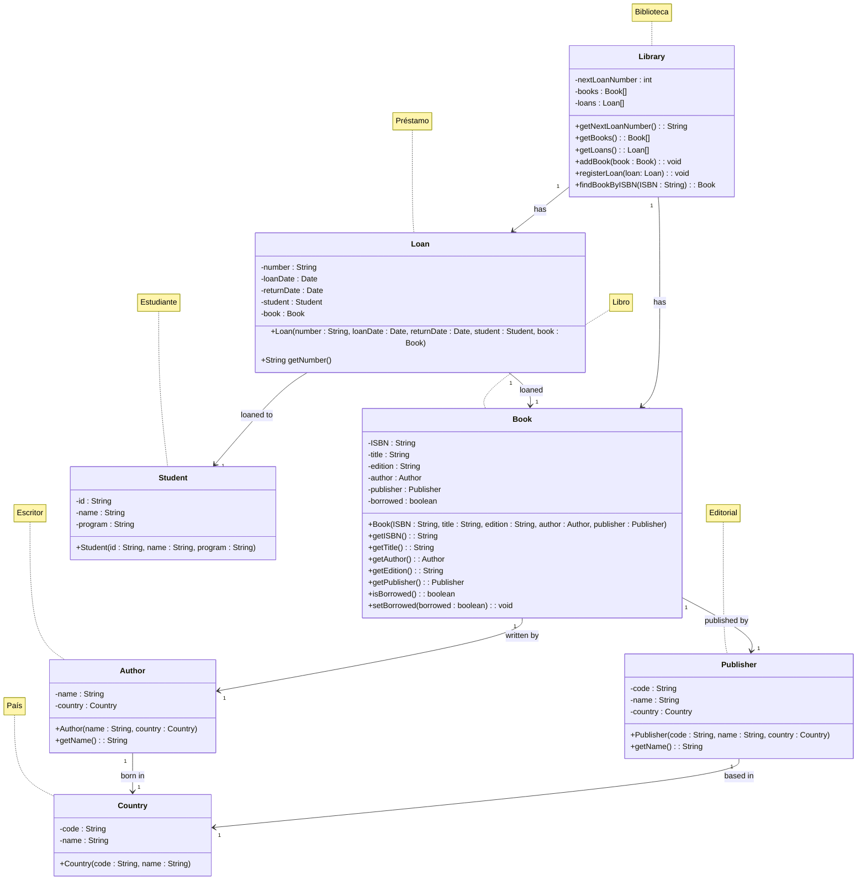

# Modelo de Dominio - Sistema de Biblioteca Universitaria

## Descripción

Este documento describe las clases del modelo de dominio del Sistema de Biblioteca Universitaria, que representan las
entidades principales y sus relaciones para la gestión de préstamos de libros.

## Diagrama de Clases

